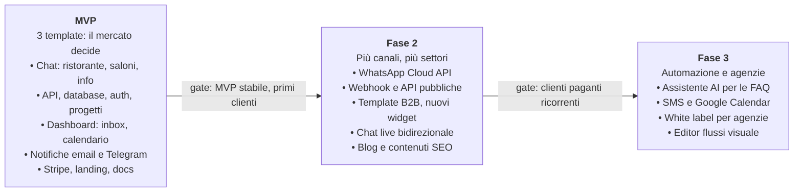
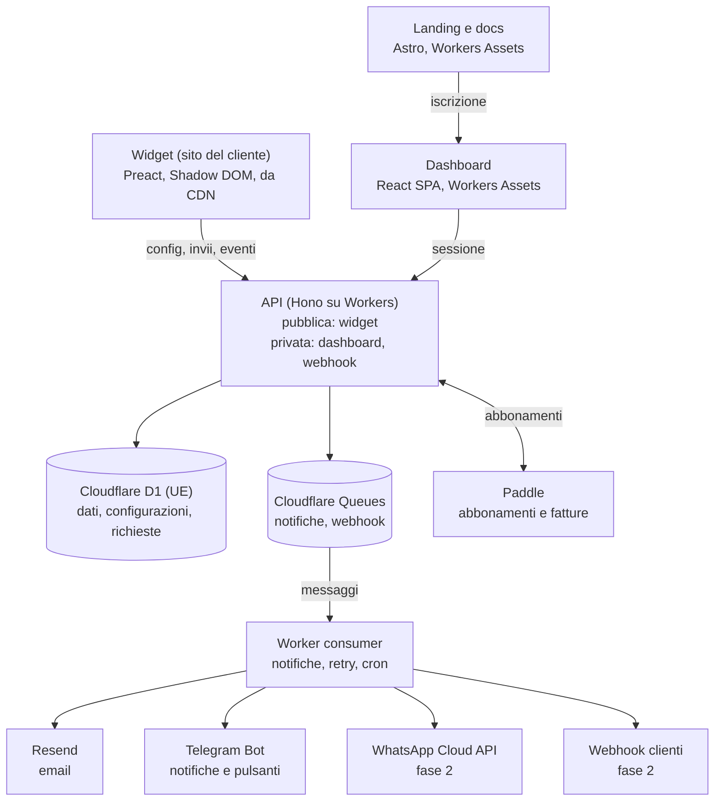

# Snippo — Documentazione di progetto

Ultimo aggiornamento: 8 ottobre 2026

# Parte 1 — Documentazione funzionale

## 1. Visione e proposta di valore

Snippo è una piattaforma di widget che uno sviluppatore integra con una riga di codice, come Formspree. Il primo widget è una chat guidata. L'azienda finale riceve richieste strutturate (prenotazioni, contatti, domande) e viene avvisata sui canali che usa già. I widget successivi (prenotazioni a calendario, recensioni, FAQ) useranno lo stesso account, la stessa dashboard e le stesse notifiche.

**Problema.** Le piccole aziende ricevono richieste da form statici o da chat generiche. In entrambi i casi arrivano messaggi incompleti, da leggere e richiamare a mano. Il titolare di un ristorante non apre una dashboard: guarda il telefono.

**Proposta di valore.**

- **Per lo sviluppatore:** un `<script>` con una chiave pubblica e il widget funziona. Niente backend, database o notifiche da costruire.
- **Per l'azienda:** una conversazione guidata che raccoglie dati completi (data, ora, persone, telefono). La notifica arriva su email, Telegram e, in seguito, WhatsApp, con azioni rapide come Conferma e Rifiuta.
- **Per il visitatore:** un'esperienza familiare da chat, veloce da mobile, senza registrarsi.

**Posizionamento.** Non è un live chat generico come Tawk.to, Crisp, Intercom o Chatwoot. È un form conversazionale con template per settore e notifiche push all'azienda. L'MVP esce con tre template (ristorante, appuntamenti, richiesta informazioni) per capire quale mercato risponde prima. Il settore che converte meglio riceverà poi funzioni dedicate.

## 2. Utenti e personas

Il prodotto serve quattro tipi di utenti. Chi paga è l'azienda, direttamente o tramite lo sviluppatore che la segue.

| Persona | Chi è | Cosa vuole | Dove interagisce |
| --- | --- | --- | --- |
| Sviluppatore / agenzia | Freelance o web agency che realizza siti per clienti | Integrare in 2 minuti, gestire più clienti da un account, rivendere il servizio | Landing, documentazione, dashboard |
| Titolare azienda | Ristoratore, parrucchiere, studio, PMI | Ricevere richieste complete e rispondere dal telefono | Notifiche (email, Telegram, WhatsApp), dashboard mobile |
| Operatore / staff | Cameriere, receptionist, segreteria | Vedere e gestire le richieste del giorno | Dashboard, notifiche |
| Visitatore | Cliente finale sul sito dell'azienda | Prenotare o chiedere info in pochi tocchi | Widget |

Un account (Organizzazione) può contenere più Progetti, cioè più siti o clienti. Questo copre il caso dell'agenzia che gestisce dieci ristoranti.

## 3. Funzionalità del widget

Il widget è una bolla in basso a destra che si apre in una finestra di chat. Pone domande guidate secondo un **flusso** configurato, poi invia una **richiesta** strutturata al backend.

**Comportamento base**

- Pulsante flottante (launcher) con colore, icona, posizione e testo di benvenuto configurabili.
- Conversazione a passi: messaggio del "bot" e risposta del visitatore tramite pulsanti rapidi, testo libero, selettore data/ora, numero o telefono.
- Riepilogo finale, consenso privacy obbligatorio e invio.
- Conferma al visitatore, con email di conferma opzionale se ha lasciato un indirizzo.
- Orari di apertura: fuori orario il widget mostra un messaggio dedicato o blocca le prenotazioni.
- Multilingua (IT ed EN all'MVP), rilevato dal browser o forzato da configurazione.
- Responsive: a schermo intero su mobile, finestra su desktop.
- Accessibile: navigazione da tastiera, ARIA, contrasto AA.

**Tipi di passo di un flusso**

| Tipo | Esempio | Validazione |
| --- | --- | --- |
| Messaggio | "Ciao! Vuoi prenotare un tavolo?" | — |
| Scelta rapida | Pranzo / Cena | Una opzione tra quelle date |
| Testo | Nome | Lunghezza min/max |
| Numero | Numero di persone | Intervallo, es. 1–12 |
| Data | Giorno | Non nel passato, giorni di chiusura esclusi |
| Orario | 20:30 | Fasce orarie configurate |
| Telefono / email | +39 … | Formato E.164 / RFC 5322 |
| Riepilogo | "Confermi?" | — |

**Template per settore**

- **Ristorante:** prenotazione tavolo (data, orario, persone, nome, telefono, note e allergie).
- **Appuntamenti** (parrucchiere, estetista, studio): servizio, data, orario, contatto.
- **Richiesta informazioni:** argomento, messaggio, contatto preferito.
- **Lead B2B:** azienda, ruolo, esigenza, budget indicativo, contatto.

**Fase 2:** risposte automatiche alle FAQ con AI, chat bidirezionale in tempo reale tra operatore e visitatore, allegati.

## 4. Funzionalità della dashboard

La dashboard è il pannello in cui l'azienda configura il widget e gestisce le richieste ricevute. È pensata prima di tutto per il mobile, perché il titolare la apre dal telefono partendo da una notifica.

| Area | Funzioni | Fase |
| --- | --- | --- |
| Autenticazione | Registrazione, login email+password e magic link, Google OAuth, reset password, verifica email | MVP |
| Organizzazione e team | Creazione organizzazione, inviti membri, ruoli (Owner, Admin, Operatore) | MVP |
| Progetti | Un progetto per sito; chiave pubblica del widget; domini autorizzati; snippet da copiare | MVP |
| Editor widget | Aspetto (colori, logo, testi, posizione), anteprima live, scelta template, modifica passi del flusso | MVP |
| Orari e disponibilità | Orari di apertura, giorni di chiusura, fasce orarie, capienza massima per fascia | MVP |
| Inbox richieste | Elenco con filtri (stato, data, flusso), dettaglio, cambio stato (Nuova, Confermata, Rifiutata, Completata), note interne | MVP |
| Vista calendario | Prenotazioni per giorno e fascia oraria, coperti totali | MVP |
| Notifiche | Canali per progetto (email, Telegram), destinatari, test di invio | MVP |
| Statistiche | Aperture del widget, conversazioni avviate e completate, tasso di conversione, richieste per giorno | MVP (base) |
| Esportazione | CSV delle richieste | MVP |
| Webhook e API | URL webhook, firma HMAC, log consegne, API key private | Fase 2 |
| Fatturazione | Piano attivo, utilizzo del mese, upgrade, fatture (Stripe Customer Portal) | MVP |
| Integrazione WhatsApp | Collegamento numero WhatsApp Business, template | Fase 2 |
| Assistente AI | Base di conoscenza (FAQ, menu, orari) e risposte automatiche | Fase 3 |

## 5. Sito marketing (landing page)

La landing ha un obiettivo misurabile: portare il visitatore alla registrazione gratuita. Il secondo obiettivo è convincere lo sviluppatore che l'integrazione richiede due minuti.

**Pagine**

1. **Home:** hero con widget demo funzionante sulla pagina stessa, problema e soluzione, tre vantaggi, casi d'uso per settore, snippet di codice, prezzi in sintesi, FAQ, call to action.
2. **Soluzioni per settore:** Ristoranti, Appuntamenti, PMI e B2B. Ogni pagina ha il suo template demo, serve per la SEO e misura quale settore converte meglio (registrazioni per pagina).
3. **Prezzi:** confronto dei piani e FAQ di fatturazione.
4. **Documentazione sviluppatori:** quick start, opzioni di configurazione, API JavaScript del widget (`open`, `close`, eventi), webhook.
5. **Blog e guide** (fase 2) per la SEO, es. "Come ricevere prenotazioni dal sito del ristorante".
6. **Legali:** Privacy Policy, Cookie Policy, Termini di servizio, DPA (accordo sul trattamento dei dati).

**Requisiti**

- Italiano ed inglese, SEO tecnica (sitemap, meta, Open Graph, dati strutturati), Core Web Vitals verdi.
- Analytics rispettosi della privacy, senza cookie banner invasivi (Plausible o Umami).
- Il widget della landing è il prodotto stesso: le richieste arrivano nella nostra dashboard.

## 6. Flussi utente principali

Sono tre i flussi da far funzionare per l'MVP: l'onboarding dell'azienda, la richiesta del visitatore e la gestione della richiesta.

**A. Onboarding (obiettivo: widget online in meno di 5 minuti)**

1. Registrazione dalla landing e verifica dell'email.
2. Creazione dell'organizzazione e del primo progetto (nome, sito, settore).
3. Scelta del template, personalizzazione dei colori e anteprima live.
4. Configurazione delle notifiche, es. collegamento del bot Telegram con un codice.
5. Copia dello snippet `<script>` da incollare nel sito (o invio allo sviluppatore via email).
6. Il primo caricamento del widget sul dominio autorizzato marca il progetto come "attivo".

**B. Richiesta del visitatore (esempio: prenotazione)**

1. Il visitatore apre il widget e il backend registra l'evento "aperto".
2. Risponde ai passi: data, orario (solo fasce libere), persone, nome, telefono, note.
3. Vede il riepilogo, accetta la privacy e invia.
4. L'API valida, salva la richiesta con stato **Nuova** e mette in coda le notifiche.
5. Il visitatore vede "Richiesta inviata, riceverai conferma".

**C. Gestione della richiesta**

1. Il titolare riceve la notifica su Telegram o email con i dati e i pulsanti **Conferma** / **Rifiuta**.
2. Il clic aggiorna lo stato tramite un link firmato o un callback del bot, senza login.
3. Il visitatore riceve l'esito via email (SMS o WhatsApp in fase 2).
4. La richiesta compare in inbox e calendario con lo storico dei cambi di stato.

## 7. Piani e prezzi (ipotesi)

Il modello è freemium con abbonamento mensile. I prezzi sono un'ipotesi iniziale da validare con i primi clienti.

| Piano | Prezzo/mese | Progetti | Richieste/mese | Canali notifica | Extra |
| --- | --- | --- | --- | --- | --- |
| Free | 0 € | 1 | 50 | Email | Logo "Powered by" visibile |
| Starter | 9 € | 1 | 500 | Email, Telegram | Niente logo, statistiche, export CSV |
| Pro | 29 € | 5 | 3.000 | + WhatsApp, webhook | Team fino a 5, AI FAQ (fase 3) |
| Agency | 79 € | 25 | 15.000 | Tutti | White label, multi-cliente, API |

I messaggi WhatsApp hanno un costo per conversazione applicato da Meta. Vanno inclusi in una quota o rifatturati a consumo. Lo sconto annuale proposto è di 2 mesi gratis. I limiti valgono per l'account, non per singolo widget: aggiungere un secondo widget non cambia piano finché si resta nelle quote.

## 8. Roadmap

L'MVP deve già essere vendibile a un ristorante, a un salone o a uno studio: chat con tre template, inbox, notifiche e pagamento. Ogni fase successiva parte solo quando la precedente ha superato il suo gate.



Le date si fissano dopo la scelta dello stack e del perimetro definitivo dell'MVP (vedi Decisioni e consigli).

# Parte 2 — Documentazione tecnica e architetturale

## 9. Architettura generale

Il sistema gira tutto su Cloudflare, nello stesso account dell'altro progetto. Tre frontend statici (widget, dashboard, landing) parlano con un'unica API su Workers. L'API scrive su D1 e passa a Cloudflare Queues tutto ciò che può fallire o rallentare: email, Telegram, WhatsApp, webhook.



L'invio di una richiesta risponde al visitatore in pochi millisecondi, anche se Telegram o il servizio email sono lenti. Il consumer della coda è un Worker con lo stesso codice del monorepo e lo stesso database. Non ci sono server o container da gestire, e in sviluppo non servono Docker né database installati in locale.

## 10. Widget: architettura tecnica

Il widget è un bundle JavaScript sotto i 30 KB gzip, servito da CDN. Gira in uno Shadow DOM, così non subisce né altera il CSS del sito ospite.

**Integrazione**

```html
<script src="https://cdn.snippo.io/v1/snippo.js"
        data-key="pk_live_8f3a..." async></script>
```

Da JavaScript: `Snippo.open()`, `Snippo.close()`, `Snippo.on('submitted', fn)`, `Snippo.prefill({ name })`.

**Più widget, un solo script**

- Lo sviluppatore incolla sempre lo stesso `snippo.js`. Il loader legge `data-key`, chiede la configurazione e scarica solo il bundle del tipo richiesto (`chat.js`, poi `booking.js`, `reviews.js`).
- `packages/widget-core` contiene ciò che ogni widget condivide: Shadow DOM, tema, i18n, client API, eventi, anti-spam.
- Un nuovo widget è una cartella in `apps/widgets/<tipo>` e un valore di `widgets.type`. API, dashboard, notifiche e billing restano gli stessi.

**Stack**

- TypeScript e **Preact** (3 KB) oppure Web Components puri; build con **Vite** in modalità libreria, output IIFE.
- Shadow DOM per l'isolamento degli stili; variabili CSS per il tema.
- Loader minimo (circa 2 KB) che mostra il launcher e carica il resto solo all'apertura (lazy load).
- Versionamento per URL: `/v1/` stabile, versioni specifiche immutabili (`/v1.4.2/`) con cache lunga.

**Comunicazione con il backend**

1. All'avvio: `GET /v1/widget/config?key=pk_...` restituisce tema, flusso, orari e lingua. Risposta in cache CDN per 60 s.
2. Durante il flusso: `GET /v1/widget/availability` restituisce le fasce libere per la data scelta.
3. All'invio: `POST /v1/widget/submissions` con le risposte, `Idempotency-Key` contro gli invii doppi e token anti-bot.
4. Eventi di utilizzo (aperto, passo completato, abbandono) inviati in batch con `navigator.sendBeacon`.

**Sicurezza lato widget**

- La chiave pubblica (`pk_`) identifica il progetto ma non dà accesso ai dati. L'API accetta richieste solo dai domini autorizzati (controllo `Origin`).
- Anti-spam: Cloudflare Turnstile invisibile, campo honeypot e tempo minimo di compilazione.
- Nessun cookie di terze parti; un ID sessione anonimo in `sessionStorage` per collegare gli eventi.

## 11. Backend API

Il backend è un **Cloudflare Worker** in TypeScript con framework **Hono**, che espone due superfici. La prima è pubblica e serve il widget; la seconda è privata e serve dashboard, API e integrazioni. Il lavoro lento (notifiche, email, webhook) va su **Cloudflare Queues** e lo esegue un Worker consumer.

**Stack**

- Hono su Workers, validazione con **Zod**, specifica **OpenAPI** generata dagli schemi.
- ORM **Drizzle** su **D1** (SQLite), migrazioni versionate nel repo e applicate con Wrangler.
- Code: **Cloudflare Queues** con retry e dead letter queue; lavori programmati (pulizie, retention) con Cron Triggers.
- Autenticazione dashboard: **Better Auth** su D1 (sessioni su cookie httpOnly, OAuth Google, magic link).
- Configurazione in `wrangler.jsonc`, segreti in Workers Secrets.

**Endpoint principali**

| Metodo e percorso | Autenticazione | Scopo |
| --- | --- | --- |
| `GET /v1/widget/config` | Chiave pubblica + Origin | Tema, flusso, orari del progetto |
| `GET /v1/widget/availability` | Chiave pubblica + Origin | Fasce libere per data |
| `POST /v1/widget/submissions` | Chiave pubblica + Origin + Turnstile | Crea una richiesta |
| `POST /v1/widget/events` | Chiave pubblica + Origin | Eventi di utilizzo in batch |
| `GET/POST /v1/projects` | Sessione | Gestione progetti |
| `GET/PATCH /v1/projects/:id/flows` | Sessione | Editor del flusso |
| `GET /v1/submissions` | Sessione o chiave segreta | Elenco richieste con filtri e paginazione a cursore |
| `PATCH /v1/submissions/:id` | Sessione o chiave segreta | Cambio stato, note |
| `GET /v1/actions/:token` | Token firmato monouso | Conferma/Rifiuta da email |
| `POST /v1/integrations/telegram/webhook` | Secret token di Telegram | Callback dei pulsanti del bot |
| `POST /v1/billing/stripe/webhook` | Firma Stripe | Eventi di abbonamento |

**Regole trasversali**

- Rate limiting per chiave e IP con il binding Rate Limiting dei Workers, es. 10 invii al minuto per IP e widget.
- Quote del piano verificate all'invio; al superamento il widget mostra un messaggio di fallback e l'azienda riceve un avviso.
- Idempotenza degli invii (`Idempotency-Key`), errori in formato RFC 9457 (problem+json).
- Multi-tenant: ogni query passa da un unico livello di accesso ai dati che filtra per `organization_id`. D1 non ha Row Level Security, quindi test automatici verificano l'isolamento tra tenant.
- Log strutturati con Workers Logs; il `request_id` viaggia anche nei messaggi in coda.

## 12. Dashboard e landing: stack tecnico

La dashboard è una single page app che parla con l'API. La landing è un sito statico ottimizzato per la SEO. Tenerle separate permette di rilasciarle in modo indipendente e di servire la landing interamente da CDN.

| | Dashboard (`app.snippo.io`) | Landing e docs (`snippo.io`) |
| --- | --- | --- |
| Framework | React 19 + Vite + TanStack Router | **Astro** (HTML statico, isole interattive) |
| UI | Tailwind CSS + shadcn/ui | Tailwind CSS, componenti condivisi |
| Dati | TanStack Query + client API tipizzato da OpenAPI | Contenuti in Markdown/MDX nel repo |
| Form | React Hook Form + Zod (schemi condivisi con l'API) | — |
| Grafici | Recharts | — |
| Docs | — | Starlight (tema documentazione di Astro) |
| i18n | IT, EN | IT, EN con URL localizzati |
| Hosting | CDN statico | CDN statico |

Un'alternativa valida è **Next.js** per la dashboard. Ha senso se si preferisce un solo framework per tutto, ma aggiunge un server da gestire.

L'editor del flusso, all'MVP, è una lista ordinabile di passi con un form per ciascun passo, non un canvas a nodi. Un editor visuale stile diagramma arriva solo se servono flussi con ramificazioni.

## 13. Modello dati (Cloudflare D1)

Il database è **Cloudflare D1** (SQLite), creato con giurisdizione UE. È multi-tenant con colonna `organization_id`. Usa chiavi primarie UUID v7 salvate come testo, `created_at` e `updated_at` su ogni tabella e soft delete (`deleted_at`) dove serve. I campi indicati come `jsonb` sono colonne di testo JSON, interrogabili con `json_extract`, così ogni flusso può avere campi diversi senza cambiare lo schema. Un database può arrivare a 500 MB sul piano gratuito e a 10 GB su Workers Paid ([limiti D1](https://developers.cloudflare.com/d1/platform/limits/)).

| Area | Tabella | Campi principali | Note |
| --- | --- | --- | --- |
| Identità | `users` | id, email (unique), name, avatar_url, locale, email_verified_at | Utenti della dashboard |
| Identità | `accounts` | id, user_id, provider (password, google), provider_account_id, password_hash | Gestita dalla libreria di auth |
| Identità | `sessions` | id, user_id, token_hash, expires_at, ip, user_agent | |
| Organizzazione | `organizations` | id, name, slug, country, vat_number, billing_email, plan_id | Il tenant |
| Organizzazione | `memberships` | organization_id, user_id, role (owner, admin, operator) | PK composta |
| Organizzazione | `invitations` | id, organization_id, email, role, token_hash, expires_at, accepted_at | |
| Progetti | `projects` | id, organization_id, name, industry, timezone, default_locale, status | Un progetto per sito |
| Progetti | `project_domains` | id, project_id, domain, verified_at | Whitelist per `Origin` |
| Progetti | `api_keys` | id, project_id, type (secret), prefix, key_hash, last_used_at, revoked_at | Salvato solo l'hash delle chiavi segrete |
| Configurazione | `widgets` | id, project_id, type (chat, poi booking, reviews…), name, public_key (pk_…), theme jsonb (colori, logo, posizione), texts jsonb per lingua, show_branding, is_active | |
| Configurazione | `flows` | id, widget_id, name, template, is_active, published_version_id | |
| Configurazione | `flow_versions` | id, flow_id, version, definition jsonb (passi, validazioni, rami), published_at | Ogni richiesta punta alla versione usata |
| Disponibilità | `business_hours` | id, project_id, weekday, opens_at, closes_at | |
| Disponibilità | `closures` | id, project_id, date_from, date_to, reason | Ferie, chiusure |
| Disponibilità | `time_slots` | id, project_id, weekday, start_time, capacity (coperti o posti) | Capienza per fascia |
| Dati | `submissions` | id, project_id, widget_id, flow_version_id, status, answers jsonb, contact_name, contact_phone, contact_email, booking_at, party_size, locale, source_url, ip_hash, consent_at | Il cuore: la richiesta. Campi chiave estratti per filtri e calendario |
| Dati | `submission_events` | id, submission_id, type (created, status_changed, note, notified), actor_user_id, data jsonb | Storico e audit della richiesta |
| Analytics | `widget_events` | id, project_id, widget_id, session_id, type (loaded, opened, step, submitted, abandoned), step_key, created_at | Su Workers Analytics Engine invece che su D1, per non consumare spazio del database |
| Notifiche | `notification_channels` | id, project_id, type (email, telegram, whatsapp, webhook), config jsonb (cifrato), is_active | |
| Notifiche | `notification_deliveries` | id, channel_id, submission_id, status, attempts, last_error, sent_at | Retry e log |
| Notifiche | `action_tokens` | id, submission_id, action (confirm, reject), token_hash, expires_at, used_at | Link Conferma/Rifiuta |
| Billing | `plans` | id, code, name, price_cents, limits jsonb (progetti, richieste, canali) | |
| Billing | `subscriptions` | id, organization_id, plan_id, stripe_customer_id, stripe_subscription_id, status, current_period_end | Sincronizzata dai webhook Stripe |
| Billing | `usage_counters` | organization_id, period (YYYY-MM), submissions_count, whatsapp_count | Controllo delle quote |
| Sistema | `audit_logs` | id, organization_id, actor_user_id, action, entity, entity_id, diff jsonb, ip | Azioni amministrative |

**Relazioni principali**

- `organizations` 1—N `projects` 1—N `widgets` 1—N `flows` 1—N `flow_versions`.
- `users` N—N `organizations` tramite `memberships`.
- `widgets` 1—N `submissions` 1—N `submission_events`; ogni `submission` punta alla `flow_version` con cui è stata compilata.
- `projects` 1—N `notification_channels` 1—N `notification_deliveries` N—1 `submissions`: i canali sono del progetto e valgono per tutti i suoi widget.
- `organizations` 1—1 `subscriptions`; `usage_counters` per organizzazione e mese.

**Indici chiave:** `submissions (project_id, status, created_at desc)`, `submissions (project_id, booking_at)`, `api_keys (prefix)`, `project_domains (project_id, domain)`, `widget_events (project_id, created_at)`.

## 14. Notifiche e integrazioni

Ogni richiesta pubblica un messaggio su Cloudflare Queues per ciascun canale attivo del progetto. Il Worker consumer invia con retry e backoff (fino a 5 tentativi, poi dead letter queue) e registra l'esito in `notification_deliveries`. Un canale che fallisce non blocca gli altri.

| Canale | Servizio | Uso | Note | Fase |
| --- | --- | --- | --- | --- |
| Email transazionale | **Resend** (alternative: Postmark, Amazon SES) | Notifica all'azienda, conferma al visitatore, email di sistema | Template con React Email; dominio di invio con SPF, DKIM, DMARC | MVP |
| Telegram | Telegram Bot API | Notifica istantanea con pulsanti inline Conferma/Rifiuta | Gratuito; collegamento con `/start <codice>` dal bot | MVP |
| Webhook | Proprio | Integrazione con gestionali, Zapier, Make | Firma HMAC-SHA256 nell'header, retry, log consultabile | Fase 2 |
| WhatsApp | WhatsApp Business Cloud API (Meta) | Notifica all'azienda e conferma al visitatore | Verifica azienda su Meta, template approvati, finestra di 24 h, costo per conversazione | Fase 2 |
| SMS | Twilio o Vonage | Conferma al visitatore senza email | A consumo | Fase 3 |
| Calendario | Google Calendar, file .ics | Prenotazioni confermate nel calendario | OAuth Google | Fase 3 |
| Pagamenti | Stripe Billing + Customer Portal | Abbonamenti dei clienti | Webhook sincronizza `subscriptions` | MVP |

WhatsApp richiede la verifica dell'azienda su Meta Business per ogni numero. Per l'MVP conviene un **numero WhatsApp condiviso** del servizio, che invia notifiche template alle aziende. Il numero proprio del cliente (tramite Embedded Signup) diventa una funzione del piano Pro.

## 15. Sicurezza, privacy e GDPR

Trattiamo dati personali dei visitatori (nome, telefono, email) per conto delle aziende. Le aziende sono **titolari** del trattamento e noi siamo **responsabili** (art. 28 GDPR). I dati restano in UE e ogni scelta tecnica parte da qui.

**Privacy e conformità**

- Database D1 creato con giurisdizione `eu`: i dati sono salvati ed elaborati solo in UE ([data location D1](https://developers.cloudflare.com/d1/configuration/data-location/)). La giurisdizione si sceglie solo alla creazione. Fornitori con DPA firmato ed elenco dei sub-responsabili pubblico.
- DPA standard accettato all'attivazione del piano; registro dei trattamenti.
- Consenso esplicito nel widget, con link alla privacy dell'azienda; data e ora del consenso salvate (`consent_at`).
- Minimizzazione: IP salvato solo come hash; nessun cookie di tracciamento nel widget.
- Retention configurabile per progetto (default 24 mesi), poi cancellazione automatica con un Cron Trigger; export e cancellazione dei dati di un visitatore su richiesta.

**Sicurezza applicativa**

- TLS ovunque, HSTS; password con PBKDF2-SHA256 via WebCrypto (100.000 iterazioni, il massimo ammesso dai Workers); 2FA (TOTP) opzionale per la dashboard.
- Chiavi API segrete salvate solo come hash; credenziali dei canali (token Telegram e WhatsApp) cifrate con AES-256-GCM, chiave in Workers Secrets.
- Autorizzazione per ruolo e tenant su ogni endpoint, centralizzata nel livello di accesso ai dati, con test automatici sull'isolamento tra tenant.
- Protezione dagli abusi: WAF e rate limiting Cloudflare, Turnstile, controllo `Origin`, limiti di dimensione del payload, sanitizzazione dell'output (XSS) in dashboard ed email.
- Header di sicurezza: CSP sulla dashboard e sulla landing, `frame-ancestors`.
- Backup: D1 Time Travel ripristina il database a un minuto qualsiasi degli ultimi 30 giorni (7 sul piano gratuito); export settimanale su R2; test di ripristino trimestrale.
- Dipendenze controllate (Dependabot, `pnpm audit`) e scansione dei segreti nel repo.

## 16. Hosting, infrastruttura e costi

Tutto gira sull'account Cloudflare già attivo per l'altro progetto. Per lo sviluppo basta il piano gratuito; in produzione serve Workers Paid (5 $ al mese) per i limiti più alti di D1 e Queues. La spesa totale dell'MVP resta sotto i 20 € al mese. I costi dei servizi esterni a Cloudflare sono approssimativi e vanno verificati sui listini ([prezzi Queues](https://developers.cloudflare.com/queues/platform/pricing/)).

| Componente | Servizio | Note | Costo MVP |
| --- | --- | --- | --- |
| DNS, CDN, WAF | Cloudflare | Dominio sullo stesso account | 0 € |
| Widget (file statici) | Workers Static Assets | `cdn.snippo.io` | 0 € |
| Landing + docs | Workers Static Assets (o Pages) | `snippo.io` | 0 € |
| Dashboard (SPA) | Workers Static Assets (o Pages) | `app.snippo.io` | 0 € |
| API | Workers | `api.snippo.io` | Incluso in Workers Paid (5 $/mese) |
| Database | D1, giurisdizione UE | Database separati per dev, staging e prod | Incluso entro le soglie |
| Code e job | Queues, Cron Triggers | Notifiche, webhook, pulizie | Incluso entro le soglie |
| Rate limit e cache | Binding Rate Limiting, KV | Limiti per IP e widget, cache della configurazione | Incluso |
| Eventi del widget | Workers Analytics Engine | Aperture, passi, abbandoni | Incluso entro le soglie |
| File (loghi, allegati) | R2 | | 0–2 € |
| Anti-bot | Turnstile | | 0 € |
| Analytics landing | Cloudflare Web Analytics | Senza cookie | 0 € |
| Email transazionale | Resend | Fuori da Cloudflare | 0–20 € |
| Errori | Sentry | SDK per Workers | 0 € (piano Developer) |
| Uptime | Better Stack | Pagina di stato | 0–10 € |
| Pagamenti | Paddle | | Commissione per transazione |
| Dominio | `snippo.io` | | 30–60 €/anno |

**Domini e sottodomini**

- `snippo.io`: landing e docs (dominio da verificare; alternativa `snippo.app`)
- `app.snippo.io`: dashboard
- `api.snippo.io`: API
- `cdn.snippo.io`: script dei widget
- `status.snippo.io`: pagina di stato

**Account condiviso:** tutte le risorse hanno il prefisso `snippo-` e la CI usa un token API dedicato con permessi limitati. Il piano gratuito ammette 10 database D1 per account, condivisi con l'altro progetto. Se Snippo diventa un'attività separata, le risorse si spostano su un account suo.

**Crescita:** il limite da tenere d'occhio è la dimensione di D1 (10 GB per database). Oltre quella soglia si può dividere il database per gruppi di clienti, oppure passare a Postgres tramite Hyperdrive senza cambiare l'API.

## 17. Repository, ambienti, CI/CD e monitoraggio

Tutto il codice vive in un unico monorepo privato su GitHub, OscarIuliano/snippo, gestito con **pnpm workspaces + Turborepo**. Schemi Zod, tipi e client API sono condivisi tra widget, API e dashboard: un campo cambiato nell'API rompe la build della dashboard invece di rompere la produzione.

**Struttura del repository**

```
snippo/
├── apps/
│   ├── widgets/
│   │   ├── loader/    # snippo.js: carica il widget giusto
│   │   └── chat/      # primo widget (Preact)
│   ├── api/           # Worker Hono: API pubblica e privata
│   ├── worker/        # Worker consumer di Queues + Cron Triggers
│   ├── dashboard/     # React SPA
│   └── web/           # Astro: landing + docs
├── packages/
│   ├── widget-core/   # Shadow DOM, tema, i18n, client API, eventi
│   ├── db/            # schema Drizzle, migrazioni D1, seed
│   ├── shared/        # schemi Zod, tipi, costanti
│   ├── emails/        # template React Email
│   ├── ui/            # componenti condivisi
│   └── config/        # tsconfig, eslint, tailwind
├── docs/              # questa documentazione
└── .github/workflows/
```

**Ambienti**

| Ambiente | Scopo | Database | Rilascio |
| --- | --- | --- | --- |
| Locale | Sviluppo | `wrangler dev`: D1 simulato da Miniflare dentro `node_modules`, senza Docker; oppure `--remote` sul D1 di dev | — |
| Dev / preview | Test di ogni pull request | D1 `snippo-dev` (UE) | Preview URL dei Workers sulla PR |
| Staging | Test prima del rilascio | D1 `snippo-staging` (UE) | Automatico su `main` |
| Produzione | Clienti | D1 `snippo-prod` (UE) con Time Travel | Tag di release o approvazione manuale |

**Pipeline CI/CD (GitHub Actions)**

1. Su ogni PR: lint, type check, test unitari (Vitest), test di integrazione dell'API con `@cloudflare/vitest-pool-workers` su un D1 simulato, build di tutte le app.
2. Test end-to-end (Playwright) del widget integrato in una pagina di prova e della dashboard.
3. Controllo della dimensione del bundle del widget: la build fallisce sopra i 30 KB gzip.
4. Merge su `main`: migrazioni D1 e `wrangler deploy` in staging.
5. Release: migrazioni e deploy in produzione, pubblicazione del widget con la nuova versione.
6. Conventional Commits e changelog generato (Changesets) per il widget, che è un prodotto versionato pubblicamente.

**Monitoraggio**

- Sentry per gli errori su widget, dashboard, API e worker, con release e source map.
- Uptime check ogni minuto su `api/health` e sullo script del widget, pagina di stato pubblica.
- Allarmi su tasso di errore dell'API, coda notifiche in ritardo (oltre 5 minuti) e consegne fallite.
- Metriche di prodotto in dashboard admin interna: registrazioni, progetti attivi, richieste al giorno, MRR.

## 18. Decisioni e consigli

Nome, repository, strategia sui template e piattaforma (tutto su Cloudflare: Workers, D1, Queues, nello stesso account dell'altro progetto) sono decisi. Le altre righe sono i miei consigli; quelle "Da verificare" richiedono un controllo esterno (commercialista, registri di domini e marchi).

| Tema | Scelta | Perché | Stato |
| --- | --- | --- | --- |
| Nome | Snippo | Breve, richiama lo snippet da incollare, regge una famiglia di widget | Deciso |
| Repository | github.com/OscarIuliano/snippo, privato | Un solo monorepo per widget, API, dashboard e landing | Deciso |
| Template MVP | Ristorante, appuntamenti, richiesta informazioni; B2B in fase 2 | Scopriamo quale mercato risponde; il codice è lo stesso, cambia solo il flusso | Deciso |
| Widget | Preact + `widget-core` condiviso | 3 KB, componenti riusabili tra widget; con Web Components puri l'interfaccia richiede più codice | Consigliato |
| Dashboard | React + Vite (SPA) | Statica e gratuita su Cloudflare Pages; l'API è già separata, Next.js aggiungerebbe un server | Consigliato |
| WhatsApp | Fase 2, numero condiviso del servizio | Evita la verifica Meta per ogni cliente durante l'MVP | Consigliato |
| Prezzi | Ipotesi della sezione 7, poi 10 interviste prima del lancio (4 ristoranti, 4 saloni o studi, 2 agenzie) | Si validano insieme prezzo e settore di partenza | Consigliato |
| Pagamenti | Paddle all'inizio, Stripe più avanti | Paddle è Merchant of Record: incassa e gestisce IVA UE e fatture al posto nostro. Stripe conviene quando i volumi giustificano commissioni più basse | Da verificare |
| Fatturazione elettronica | Con Paddle si fattura solo a Paddle; con Stripe serve un collegamento SDI (es. Fatture in Cloud) | In Italia le fatture B2B passano dallo SDI | Da verificare |
| Forma giuridica | Partita IVA in regime forfettario per partire, SRL quando i ricavi crescono | Costi fissi bassi durante la validazione | Da verificare |
| Dominio e marchio | snippo.io o snippo.app, più ricerca marchio su EUIPO | Nome breve: probabili omonimie da escludere prima del lancio | Da verificare |
